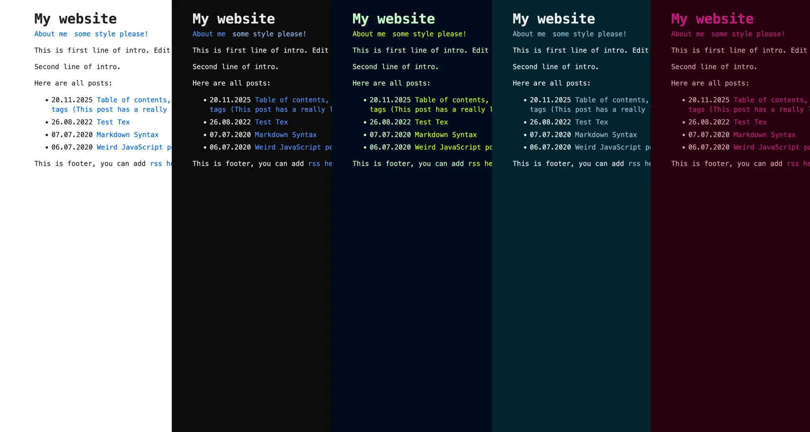

# some style please!
Super fast and clean [Hugo](https://gohugo.io/) theme based on [nostyleplease](https://github.com/hanwenguo/hugo-theme-nostyleplease). I wanted to keep the minimalist and attractive design, but also add multilingual support and page support. I added more color options.

### [Visit theme demo in dark color scheme](https://004822.xyz/demosomestyleplease/).

## Features
* Super fast (**~8 KB of CSS!**)
* Multilingual support
* Many color schemes (light, dark, matrix, bear, together and auto based on system preference)
* Responsive and content first (typography optimized for maximum readability)
* RSS feed (with support for multiple languages)
* MathJax support

## Installation
The easiest way is to clone this repo (or add as a submodule) to themes/somestyleplease then append `theme = 'somestyleplease'` as a newline to config.toml. Pages shipped with theme as examples have `draft: true` in their frontmatters, use `--buildDrafts` to build them.

## Usage
You can edit `config.toml` file to customize your blog. You can change things such as the name of the blog, the author, the appearance of the theme, how dates are formatted, etc. Customizable fields should be straightforward to understand. Note that the `config.toml` under root directory of your hugo site will completely override the one in the theme directory, so copy the attributes you want to keep or edit from the theme's `config.toml` to your site's `config.toml`.

### Adding table of contents
You can add a table of contents by adding the `toc: true` param to your post front matter. If you want a border around it you can also set `tocBorder: true`. The toc style behavior is handled by Goldmark and the defaults can be found in the `config.toml` file.

### Using color schemes
You can use pre-defined color schemes. Set in `config.toml` parameter `apperance ="auto"` to `light`, `dark`, `matrix`, `bear`, `together` to get color scheme you want. If you leave `auto` the webste will load with the light or dark color scheme - depending on your system settings.

### Multilingual website
The template is adapted to support multiple languages, although the website can, of course, be in one language. Blog entries and pages should be placed in the following structure `/content/pages/` and `/content/posts/`. Look at sample draft posts to better understand structure of files.

The content of the home page, category descriptions, RSS feeds, and other static elements is located in the i18n folder. Note that the `i18n` under root directory of your hugo site will completely override the one in the theme directory. It's good practice to do it under your root folder, this will make it easier to update your template and you won't have to revise the translations of your website every time.

## Thanks
Some of the code comes from  [hanwenguo/hugo-theme-nostyleplease](https://github.com/hanwenguo/hugo-theme-nostyleplease) and  [wooseopkim/hugo-theme-nostyleplease](https://github.com/wooseopkim/hugo-theme-nostyleplease). Some of the test pages are from [this jekyll theme](https://github.com/huangyz0918/moving). I'm very grateful to everyone who contributed to this template.

## License and contributing
The theme is available as open source under the terms of the [MIT License](https://opensource.org/licenses/MIT). Bug reports and pull requests are welcome on GitHub.